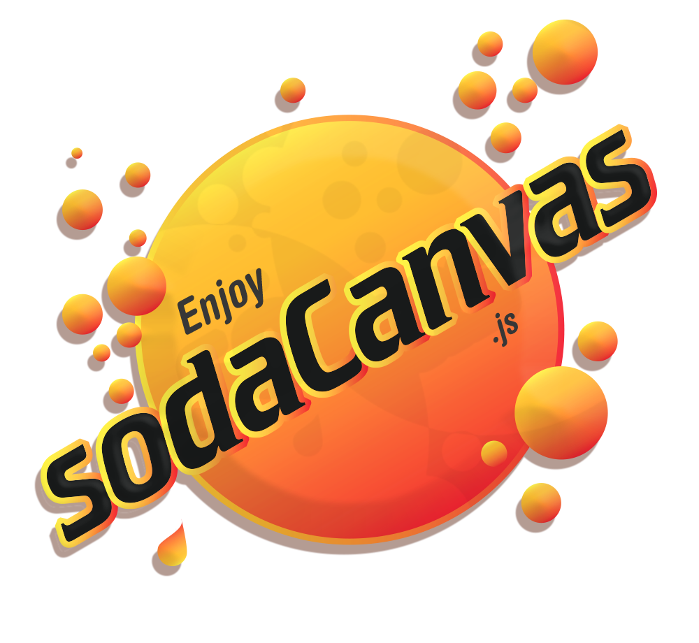

#  Soda canvas 
## **A flexible object orientated html5 canvas library**



### Short introduction example
Init a rectangle:

`var sodaRect = new rect(width, height, x, y, 'black');`

Animate its atributes, using easing, and timing in ms:
```
sodaRect.animate({
	width:100,
	height:100,
	x: x,
	y: y,
}, easing.easeInQuad, 1000)
```


animate() returns a promise when the animation is complete:
```
sodaRect.animate({
	width:200,
	height:200,
}.then(() => sodaRect.animate({
	width:50,
	height:50,
}, easing.easeInQuad, 1000) ))
```


### Library syntax

**Create new soda object:**

```var sodaObject = new Circle(width, height, x, y, 'black');```


**An object has the following**

**Animation this object using its build in vars**
returns promise
```
sodaRect.animate({
	width:100,
	height:100,
	x: x,
	y: y,
}
```

